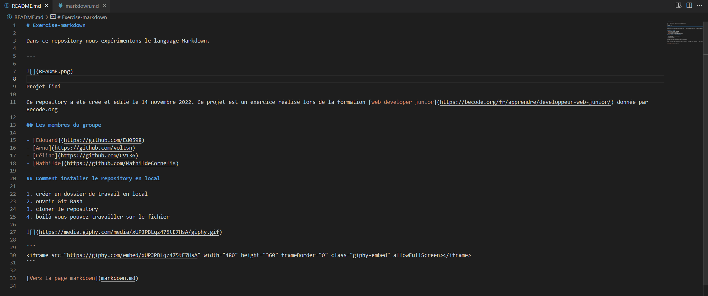
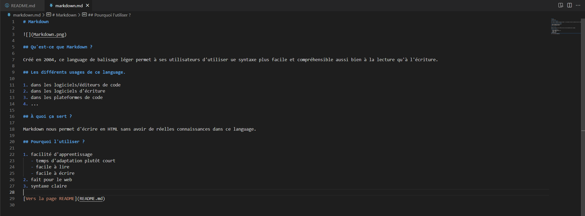

# Exercise-markdown

In this repository we experiment with the Markdown language.

---




Project completed

This repository was created and edited on November 14, 2022. This project is an exercise realized during the training [web developer junior](https://becode.org/fr/apprendre/developpeur-web-junior/) given by Becode.org

## The members of the group

- [Edouard](https://github.com/Ed0598)
- [Arno](https://github.com/voltsn)
- [Céline](https://github.com/CV136)
- [Mathilde](https://github.com/MathildeCornelis)

## How to install the repository locally

1. create a local working folder
2. open Git Bash
3. clone the repository
4. now you can work on the file


```
<iframe src="https://giphy.com/embed/xUPJPBLqz475tE7HsA" width="480" height="360" frameBorder="0" class="giphy-embed" allowFullScreen></iframe>
```

[To the Markdown page](markdown.md)
