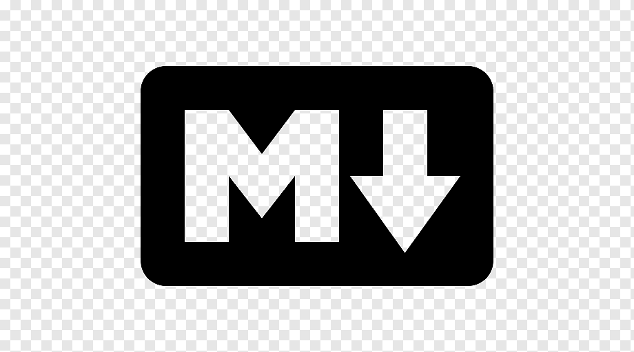

# Table des matieres
- [C'est quoi le Markdown](#cest-quoi-le-markdown)
  - [Application](#application)
  - [Evolution](#evolution)
- [utilisation](#utilisation)
- - -
# C'est quoi le Markdown
Markdown est un langage de balisage qui permet de formater du texte brute
de maniere simple pour etre rendu en HTML ou un autre format (pdf, xml...).
Il a ete creer en 2004 par [john Gruber](https://fr.wikipedia.org/wiki/John_Gruber) et :heart: [Aaron Swartz](https://fr.wikipedia.org/wiki/Aaron_Swartz).

## Application 
Le markdown a plusieurs applications:
1. Sous forme d'un editeur de texte:
    - [notion](https://notion.so)
    - [inkdrop](https://www.inkdrop.app/)
2. Outil de mise en form des publications:
    - [discord](https://support.discord.com/hc/en-us/articles/210298617-Markdown-Text-101-Chat-Formatting-Bold-Italic-Underline-)
    - reddit

## Evolution
Depuis sa creation, markdown n'as pas connu d'evolution notable de la part de
ses auteurs. De plus, ce format n'a jamais ete formellement standardise.

# Utilisation
La syntax de base de mise en page du langage markdown est facile a prendre en main.
Voici quelque examples:

| Style             | Syntax                               | Rendu                           |
|-------------------|--------------------------------------|---------------------------------|
| Italique          | \_Italique\_                         | _Italique_                      |
| Gras              | \*\*Gras\*\*                         | **Gras**                        |
| Ligne de code     | \`\`console.log("hello, world");\`\` | ``console.log("hello, world");`` |

- - -
Merci! [retour au README](README.md)

